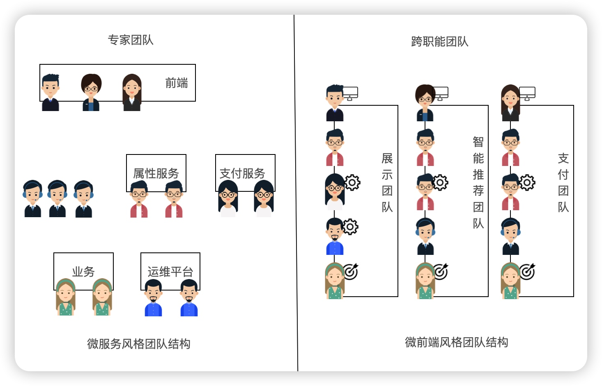
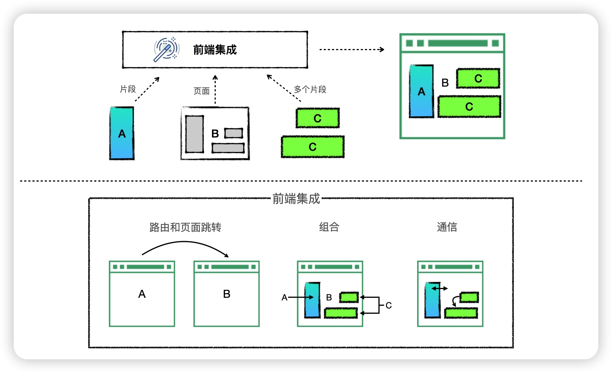

# micro-fe-book

《n 天微前端技术深度挑战》掘金专栏代码仓库，掘金专栏地址：https://juejin.cn/column/7287907234716844073

专栏所有代码位置：https://github.com/Sunny-117/micro-fe-book


# Day1 【开篇】微前端概述

## 什么是微前端？

**微前端** 这个名词，是2016年底在 [ThoughtWorks Technology Radar](https://www.thoughtworks.com/radar/techniques/micro-frontends) 被提出。这个概念天生其实就是和后端的**微服务**概念相对应的。

大家对微服务都比较熟悉了，微服务允许后端体系结构通过松散耦合的代码库进行扩展，每个代码库负责自己的业务逻辑，并公开API，每个API均可独立部署，并且各自由不同的团队拥有和维护。

现代的前端应用的发展趋势正在变得越来越富功能化，富交互化，也就是传说中的**SPA**(单页面应用)；这样越来越复杂的单体前端应用，背后的后端应用则是数量庞大的微服务集群。被一个团队维护的前端项目，随着时间推进，会变得越来越庞大，越来越难以维护。所以我们给这种应用起名为**巨石单体应用**。

在微服务的架构中，后台的服务已经按照业务进行了分离，而前端仍然是一个单体构建，通过网关来调用不同的后台服务。这个与微服务的思路是相违背的，这也就造成了你的后端团队是按照业务分割的，但是前端团队仍然是一个整体。微前端可以有效地改进这一点。

前端架构经历了从单体，到前后端分离，再到微服务，最终发展到现在的微前端，如下图


## 微前端解决了哪些问题

### 优化功能开发

微前端和其他架构最显著的区别在于团队结构。

在传统的项目架构中，功能的完成时间取决于最后一个团队的完成时间

**减少团队间的等待时间是微前端的主要目标之一**

在微前端的模型中，所有参与创建功能的人员都在同一个团队中，虽然需要完成的工作总量是相同的，但是团队内的沟通会更加的快速，可能不需要跨部门，也不需要那么正式，迭代会进行的更快。不必等待其他团队，也不必讨论任务的优先级。



### 不再有前端巨石架构

有了微前端，包括前端在内的应用程序被分割成更小的垂直系统。每个团队都有自己的一小块前端。这与一个前端巨石应用相比，构建和维护一个较小的前端更具有优势

### 能更快的适用变化

处理**遗留系统**在前端也日益成为一个较普遍的话题。开发人员要花费大量时间重构遗留代码和执行迁移策略，这将花费公司大量精力。

技术是在不断发展的，当你构建特定规模的应用程序，并希望保持竞争力时，如果新技术能为你的团队提供价值，那么能够自由的转向新技术，并且还能将试错的成本保持最小，这至关重要。

如果使用微前端，那么就意味着你不需要每隔几年重写整个前端项目以使用当前流行的技术，微前端的每一块应用都可以**本地决策**。我们甚至可以先拿出一个应用模块进行试错，然后直接整合到现有的平台上即可。

### 自主的优势

**微服务架构的核心优势之一是自治，微前端也是这样**

如果某一个应用团队需要更新某个新的功能，这个功能可能甚至导致整个JS框架的升级。在微前端框架中，你完全不必纠结，直接处理就行。但是如果是以前的巨石应用，那就是一个头痛的大问题了。你不知道要协调多少部门，多少人员，多少代码。

团队之间的沟通是昂贵的，当你想要更改别人的一段代码，即使只是一个工具库，也需要通知所有人，等待他们的反馈，也许还要讨论其他的选项。参与的人越多，处理起来越麻烦。

## 微前端的核心价值

微前端所解决的问题，正是它所体现的核心价值所在，总结其实就是下面几点：

- 技术栈无关

- 可独立开发、部署

- 增量升级

- 独立运行时

## 微前端架构的实现方式

无论如何，微前端架构需要落地的实现，我们划分了之前的垂直体系的团队结构，而每个团队的前端页面，我们最终都需要整合集成，将所有内容组装到一起。而且很多时候，也并不是每个团队提供的都是一整个页面，可能是一个页面，也可能是一个或者多个页面的片段，根据具体的业务需求来整合集成。


因此这种前端的集成，我们大体也就分为三类，**路由、组合和通信**



我们可以通过路由，直接跳转到其他子应用，这个过程可以做的很简单，一个超链接搞定。也可以把每一个子应用看成一个SPA的单页应用，然后我们进行路由单页跳转。

也可以再页面进行组合，比如简单点使用iframe嵌套，也可以使用最新的HTML5的API，web component把每一个应用做成一个组件进行嵌套。

如果页面有一些比较复杂的业务，需要应用之间传递信息，然后获取不同的页面效果，那么就需要页面之间的通信。

## 微前端架构的解决方案

* iframe
* single-spa
* web component
* webpack5 模块联邦

## 国内常见的微前端框架

集成了页面，还有一大堆事情要做：

* CSS样式隔离：不同项目，相同的样式名在页面中是会相互污染的
* js隔离：不同项目，在向window挂在变量时，有可能会互相污染
* 路由状态：子应用的路由改变需要同步到主应用上
* 通信方式：子应用之间互相通信也是必不可少的，要尽量解耦不要互相调用。
* 预加载：利用用户浏览空闲时间，提前加载其他项目的JS文件，提高用户体验
* ......

这些都是页面集成之后需要去解决的问题。当然了现在市面上已经有了一些比较成熟的微前端框架.

* qiankun
* micro-app
* 无界
* ......

不过即使有了这些框架，并不能解决我们所有企业在微前端中遇到的问题，包括微前端自己，也并非一颗银弹。因此，我们学习的重心不是在这些框架应该怎么使用，应该去探究这些框架底层是如何实现的。这样以后如果出现了问题，我们也能脱离框架，自行解决。


# Day2 【革命性】Web Component

Web Component是HTML5推出的一个新特征，顾名思义就是web组件，Web Component是一个概括性的术语。它描述的其实是三种不同的全新的API：**自定义元素，Shadow DOM和HTML模板**

* 自定义元素。 在 HTML 基础标签外扩展自定义标签元素
* Shadow DOM。 主要用于将 Shadow DOM 的内容与外层 document DOM 隔离
* HTML 模板。 使用 `<template>` 来定义组件模板，使用 `<slot>` 作为插槽使用

### Custom Elements
自定义元素，Shadow DOM和HTML 模板其实还有很多API细节，这里就不再一一的去讲解了，主要通过案例让大家了解`Web Component`，方便我们后面分析微前端框架的源码.

首先是如何创建一个[Custom Element](https://developer.mozilla.org/zh-CN/docs/Web/API/Web_components/Using_custom_elements)

创建一个最基本的`Custom Element`
```js
class CustomButton extends HTMLElement {
  constructor() {
    super();
    let value = this.getAttribute("value");
    // 可以直接放入到innerHTML中
    // this.innerHTML = `<button>custom-button ${value}</button>`

    // 也可以通过appendChild的方式添加元素对象
    let btn = document.createElement("button");
    btn.innerHTML = `custom-button ${value}`;
    btn.addEventListener('click', () => { 
      this.setAttribute("name", "test");
      this.setAttribute("value", 89);
    })
    this.appendChild(btn);
  }
  // 当 custom element首次被插入文档DOM时，被调用
  connectedCallback() {
    console.log("connectedCallback");
  }
  // 当 custom element从文档DOM中删除时，被调用
  disconnectedCallback() {
    console.log("disconnectedCallback");
  }
  // 当 custom element增加、删除、修改自身属性时，被调用
  attributeChangedCallback(name, oldValue, newValue) {
    console.log("attribute", name, oldValue, newValue);
  }
  // 声明需要监听的属性名，只有这些属性变化时才会触发attributeChangedCallback
  static get observedAttributes() {
    return ["name", "url", "value"];
  }
}
//参数一：自定义元素名，格式有要求：短线连接的字符串
//参数二：自定义元素构造器
//参数三：可选，含有 extends 属性的对象。指定所创建的元素继承自哪个内置元素，可以继承任何内置元素
window.customElements.define("custom-button", CustomButton);
```
**界面使用**
```js
<!DOCTYPE html>
<html lang="en">
  <body>
    <button>点击</button>
    <custom-button
      name="app-button"
      url="www.baidu.com"
      value="90"
    ></custom-button>
  </body>
  <script src="test.js"></script>
  <script>
    const customButton = document.querySelector("custom-button");
    //要注意，写在这里是整个自定义元素的事件，也就是说，自定义元素里面的每一个元素，都会触发click事件
    customButton.addEventListener("click", function (e) {
      this.setAttribute("name", "test");
      this.setAttribute("value", 99);
    });
  </script>
</html>
```
### Shadow DOM

[Shadow DOM](https://developer.mozilla.org/zh-CN/docs/Web/API/Web_components/Using_shadow_DOM) 是 `Web components` 的一个重要属性是封装——可以将标记结构、样式和行为隐藏起来，并与页面上的其他代码相隔离，保证不同的部分不会混在一起，可使代码更加干净、整洁。其中，Shadow DOM 接口是关键所在，它可以将一个隐藏的、独立的 DOM 附加到一个元素上。


```js
class CustomButton extends HTMLElement {
  constructor() {
    super();
    let btn = document.createElement("button");
    btn.innerHTML = `custom-button ${value}`;
    //其他代码省略只保留关键代码...
    
    
    //创建Shadow DOM时，可以选择open或closed模式，
    //close会对外部DOM隐藏shadowRoot,这可以防止其他脚本对DOM的以外操作
    //但是也会阻止爬虫看到里面的内容，除非有特殊需求，建议默认open
    this.attachShadow({ mode: "open" });
    //这里的样式，只会作用域当前的shadowRoot中，不会影响到外部的DOM
    this.shadowRoot.innerHTML = `
      <style>
        button {
          color: red;
        }
      </style>
    `;
    this.shadowRoot.appendChild(btn);
  }
  //其他代码省略只保留关键代码
}
```


### HTML 模板
[HTML 模板](https://developer.mozilla.org/zh-CN/docs/Web/API/Web_components/Using_templates_and_slots)其实包含了`template`和`slot`两个标签

**界面**
```
<template id="add-template">
  <input type="text">
  <button>新增</button>
</template>
```

**JS**
```js
class CustomButton extends HTMLElement {
  constructor() {
    super();
    let value = this.getAttribute("value");
    
    let templateEle = document.getElementById("add-template");
    let cloneEle = templateEle.content.cloneNode(true);
    cloneEle.querySelector("input[type='text']").value = `${value}`;

    let btn = document.createElement("button");
    btn.innerHTML = `custom-button ${value}`;
    btn.addEventListener('click', () => { 
      this.setAttribute("name", "test");
      this.setAttribute("value", 89);
    })
    
    this.attachShadow({ mode: "open" });
    this.shadowRoot.innerHTML = `
      <style>
        button {
          color: red;
        }
      </style>
    `;
    this.shadowRoot.appendChild(btn);
    
    this.shadowRoot.appendChild(cloneEle);
  }
}
```

还能使用`slot`插槽
```html
<template id="add-template">
  <slot name="title"></slot>
  <input type="text">
  <button>新增</button>
</template>

<custom-button
  name="app-button"
  url="www.baidu.com"
  value="90"
>
  <div slot="title">
    <h2>新增</h2>
  </div>
</custom-button>
```

### 示例
```js
class ImageBox extends HTMLElement { 
  constructor() { 
    super();
    this.render();
  }
  render() { 
    let url = this.getAttribute('url');
    let title = this.getAttribute('title');
    let price = this.getAttribute('price');

    this.attachShadow({ mode: 'open' });
    const imageBoxTemplate = document.getElementById('image-box-template');
    const imageBoxContent = imageBoxTemplate.content.cloneNode(true);

    imageBoxContent.querySelector("img").setAttribute('src', url);
    imageBoxContent.querySelector("div.title").innerHTML = title;
    imageBoxContent.querySelector("div.price").innerHTML = `￥${price}`;

    imageBoxContent.querySelector("div.action").addEventListener('click', (e) => { 
      let target = e.target;
      if (target.classList.contains('primary')) {
        alert("预定成功")
      }
      else { 
        alert("加入购物车成功")
      }
    });

    this.shadowRoot.appendChild(imageBoxContent);
  }
}

window.customElements.define('image-box', ImageBox);
```

**界面：**
```html
<!DOCTYPE html>
<html lang="en">
  <head>
    <meta charset="UTF-8" />
    <meta http-equiv="X-UA-Compatible" content="IE=edge" />
    <meta name="viewport" content="width=device-width, initial-scale=1.0" />
    <title>Document</title>
    <style>
      .content{
        display: flex;
        flex-wrap: wrap;
      }
      .btn{
        display: inline-block;
        padding: 6px 12px;
        background-color: #ccc;
        border: 1px solid transparent;
        border-radius: 5px;
        color: #fff;
        text-decoration: none;
        font-size: 14px;
        line-height: 1.42857143;
        cursor: pointer;
      }
      .btn:hover{
        background-color: #286090;
        border-color: #204d74;
      }
      .primary{
        background-color: #409eff;
      }
      .success{
        background-color: #67c23a;
      }
    </style>
  </head>
  <body>
    <template id="image-box-template">
      <style>
        .image-box {
          width: 200px;
          height: 200px;
          border: 1px solid #ccc;
          margin: 10px;
          padding: 10px;
          box-sizing: border-box;
          transition: all 0.5s;
        }
        .image-box:hover {
          box-shadow: 3px 3px 3px rgba(0, 0, 0, 0.3);
        }
        .image-box .img {
          width: 100%;
          height: 100%;
          transition: all 0.5s;
        }
        .image-box .img:hover {
          transform: scale(1.05, 1.05);
        }
        .image-box .title {
          font-size: 20px;
          font-weight: bold;
          margin: 10px 0;
        }
        .image-box .content {
          font-size: 16px;
          color: #666;
        }
      </style>
      <div class="image-box">
        
        <div class="title"></div>
        <div class="price"></div>
        <div class="action">
          <slot name="btn-action"></slot>
        </div>
        
      </div>
    </template>

    <div class="content">
      <image-box
        url="./images/奥利奥奶茶.jpeg"
        title="奥利奥奶茶"
        price="18"
      >
        <button slot="btn-action" class="btn primary">预定</button>
      </image-box>
      <image-box
        url="./images/奥利奥蛋糕.jpeg"
        title="奥利奥蛋糕"
        price="20"
      >
        <button slot="btn-action" class="btn success">购买</button>
      </image-box>
    </div>
    
  </body>
  <script src="index.js"></script>
</html>
```